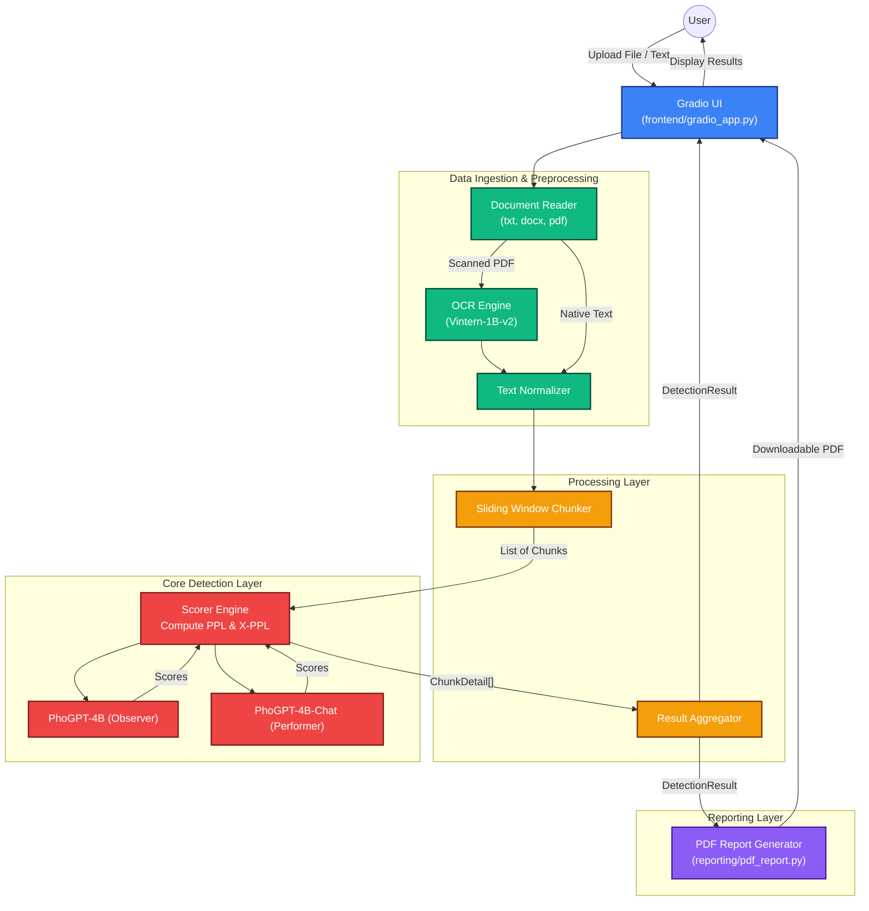

# Software Architecture: VietAIDetector

## 1. Overall Software Architecture

The architecture of VietAIDetector is designed to be highly modular, scalable, and optimized for multi-GPU inference. It is structured into five distinct layers, each responsible for a specific stage of the pipeline—from data ingestion to final report generation. This separation of concerns ensures that the AI models can be easily swapped, chunking logic can be fine-tuned, and the system can efficiently handle diverse input formats, including scanned documents requiring OCR.

### Architecture Layers:
1. **Presentation Layer (Frontend):** A responsive Gradio-based web interface that handles user inputs (text or files), configures dynamic parameters (e.g., threshold modes, chunk sizes), and displays the highlighted results and analytical charts.
2. **Data Ingestion & Preprocessing Layer:** Responsible for parsing different document formats (`.txt`, `.docx`, native `.pdf`). For scanned PDFs, it routes the document to a specialized OCR Engine powered by the `Vintern-1B-v2` Vision-Language Model (VLM). The text is then normalized to ensure consistent Vietnamese encoding.
3. **Processing Layer (Chunker & Aggregator):** The `Chunker` splits the normalized text using a dynamic sliding-window approach (configurable Window and Overlap sizes) to preserve context without exceeding the model's token limits. The `Aggregator` collects the results of all chunks to compute document-level statistics (e.g., AI percentage) and formulates the final decision based on selected thresholds.
4. **Core Detection Layer (AI Inference):** The heart of the system, utilizing the **VietBinoculars** algorithm. It employs a dual-model scoring mechanism: `PhoGPT-4B-Chat` acts as the performer to compute Perplexity (PPL), while the combination of the observer (`PhoGPT-4B`) and performer computes Cross-Perplexity (X-PPL). This layer is optimized for multi-GPU setups (e.g., distributing the models across `cuda:0` and `cuda:1`).
5. **Reporting Layer:** Generates downloadable, highly detailed PDF reports utilizing `fpdf2`, featuring color-coded chunk highlights and fully transparent detection metrics.

> **Note:** In execution order, the data flows from the Chunker (Layer 3) to the Core Detection Layer (Layer 4) for scoring, and then back to the Aggregator (Layer 3) to compile the final document-level verdict.

## 2. Pictorial Overview

The following Mermaid diagram illustrates the data flow and component interactions within the system.

*(Note: For academic publications requiring EPS/PDF formats, please refer to the `diagram/architecture.dot` Graphviz file provided in the repository to generate high-resolution, vector-based diagrams).*

## 3. Implementation Details

1. **Vintern-1B-v2 VLM Integration (OCR):** 
   - The OCR engine is lazy-loaded to save VRAM when not processing scanned PDFs.
   - It utilizes `bfloat16` precision and is explicitly bound to a target CUDA device (e.g., `DEVICE_2`) using `torch.cuda.set_device` to prevent multi-GPU tensor mismatch errors inherited from hardcoded configurations in the remote model code.
   - Anti-hallucination constraints are strictly enforced via greedy decoding (`do_sample=False`, `temperature=0.0`).

2. **Dual-Model Scoring (VietBinoculars):**
   - Implemented in `core/scorer.py`. The algorithm calculates the ratio of Perplexity (PPL) from `PhoGPT-4B-Chat` (performer) and Cross-Perplexity (X-PPL) from the observer/performer combination.
   - The inference batch size is carefully tuned (`SCORER_BATCH_SIZE = 8`) to maximize throughput on 16GB T4 GPUs without encountering Out-Of-Memory (OOM) exceptions.

3. **Dynamic Sliding Window Chunking:**
   - Implemented in `processing/chunker.py`. To analyze lengthy documents without breaching the 768-token limit of the underlying models, the text is split dynamically.
   - Default parameters: Window = 450 tokens, Overlap = 100 tokens. The overlap ensures that contextual boundaries are preserved, preventing the artificial truncation of sentences from skewing the perplexity scores.

4. **Decision Aggregation & Thresholds:**
   - Implemented in `core/metrics.py` and `processing/aggregator.py`. The system aggregates chunk-level scores and classifies them based on pre-calculated F1-score thresholds derived from the VietBinoculars paper.
   - Three operational modes are supported: `Youden` (Balanced), `Closest Point`, and `Low FPR`. A document is flagged if the ratio of AI-generated chunks exceeds the selected threshold.
